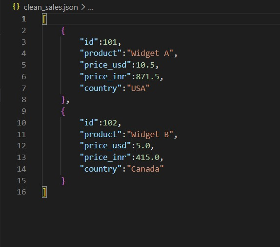
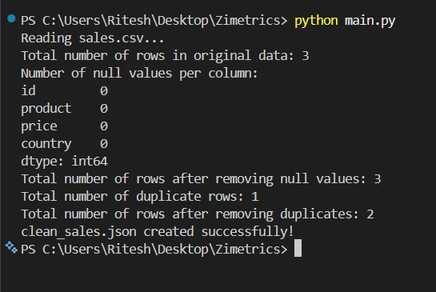

# Sales Data Cleaner

**Goal**: Write a script to process a messy CSV file and generate a clean JSON report.

---

## Setup Instructions

### Prerequisites
- Python 3.7 or higher
- pip package manager

### Installation & Execution

```bash
# 1. Install required dependencies
pip install -r requirements.txt

# 2. Run the script
python main.py
```

**Expected Output**: A `clean_sales.json` file will be created in the project root directory.

---

## The Logic (How I Thought)

### Why This Approach?

**Pandas for Data Manipulation**: I chose pandas because:
- **Built-in CSV parsing**: Handles messy data gracefully with parameters like `skipinitialspace` to auto-trim whitespace
- **Vectorized operations**: String replacements and type conversions are fast and concise
- **Native deduplication**: `.drop_duplicates()` is battle-tested and efficient
- **Flexible output**: `.to_json()` with `orient="records"` creates clean, readable JSON arrays

**Step-by-Step Cleaning Pipeline**:
1. **Read with explicit column names**: Since the CSV lacks headers, I defined them upfront to avoid confusion
2. **String cleaning before type conversion**: Removed `$` and `"` characters first, then converted to float (doing it in reverse would cause errors)
3. **Deduplication on business logic**: Used `subset=["product", "price"]` instead of all columns, since ID might differ for the same product
4. **Preserve original data**: Kept `price_usd` and added `price_inr` column instead of replacing, allowing for audit trails

### Hardest Bug & The Fix

**The Bug**: Initially, I got a `ValueError: could not convert string to float` when converting prices.

**Root Cause**: The CSV had inconsistent formatting:
- Row 1: `$10.50` (with dollar sign)
- Row 3: `10.50` (without dollar sign)

When I tried to directly convert the "price" column to float, Python couldn't parse `"$10.50"` as a number.

**The Fix**:
```python
# Step 1: Remove $ sign first (handles both cases)
df["price"] = df["price"].str.replace("$", "", regex=False)

# Step 2: Strip whitespace
df["price"] = df["price"].str.strip()

# Step 3: Now safely convert to float
df["price"] = df["price"].astype(float)
```

I also added `regex=False` to make the replacement faster (since we're matching a literal character, not a pattern).

**Debugging Process**:
1. Printed the raw values: `print(df["price"].head())`
2. Noticed the `$` prefix in some rows
3. Added the cleaning step before type conversion
4. Added `.strip()` to handle any trailing/leading spaces that might remain

---

## Output Screenshots

### Screenshot 1: Clean Sales JSON File


**What to look for in the screenshot**:
- No `$` signs or extra quotes in the data
- Prices shown as floats (not strings)
- Only 2 records (duplicate row removed - Widget A with $10.50 appeared twice)
- Both `price_usd` and `price_inr` columns present
- INR prices correctly calculated (10.50 x 83 = 871.50, 5.00 x 83 = 415.00)

### Screenshot 2: Console Output


**Key indicators**:
- Original data: 3 rows
- Duplicates found: 1 row
- Final data: 2 rows
- Success message: "clean_sales.json created successfully!"

---

## Future Improvements

If I had **2 more days**, I would add:

### 1. Dynamic Currency Conversion API (Priority: High)
- Replace hardcoded `USD_TO_INR = 83` with live rates from an API like exchangerate-api.com
- Add a `--currency` flag to convert to any target currency (EUR, GBP, etc.)
- Cache rates locally to avoid hitting API limits

### 2. Data Validation & Error Logging (Priority: High)
- Add schema validation using `pandera` to ensure:
  - IDs are positive integers
  - Prices are non-negative
  - Countries are valid ISO codes
- Log all errors to `errors.log` with row numbers for debugging
- Create a separate `rejected_rows.csv` for records that failed validation

### 3. Advanced Deduplication Logic (Priority: Medium)
- Implement fuzzy matching for product names (e.g., "Widget A" vs "Widget-A" vs "WidgetA")
- Use `fuzzywuzzy` library to catch near-duplicates
- Let users configure deduplication strategy via config file

### 4. Performance Optimization (Priority: Medium)
- For files > 1GB, use `dask` instead of pandas for parallel processing
- Add progress bars using `tqdm` for large datasets
- Implement chunked reading for memory efficiency

### 5. Interactive Dashboard (Priority: Low)
- Build a simple Streamlit UI to:
  - Upload CSV files via drag-and-drop
  - Preview cleaned data before saving
  - Download JSON/CSV/Excel formats
  - Show data quality metrics (% duplicates, % null values, price distribution)

### 6. Unit Tests (Priority: High)
- Write pytest tests for each cleaning function
- Mock edge cases: empty files, all-duplicate rows, missing columns
- Achieve 90%+ code coverage

---

## Project Structure

```
sales-data-cleaner/
├── notebooks
|   └── test.ipynb   # test code and EDA
├── raw_data/
│   ├── sales.csv    # Input messy CSV
|   └── sales.py     # Create messy data
├── screenshots/
│   ├── clean_sales_json.jpeg
│   └── console_output.jpeg
├── main.py                # Main ETL script
├── clean_sales.json       # Output clean data
├── requirements.txt       # Dependencies
└── README.md             # This file
```


